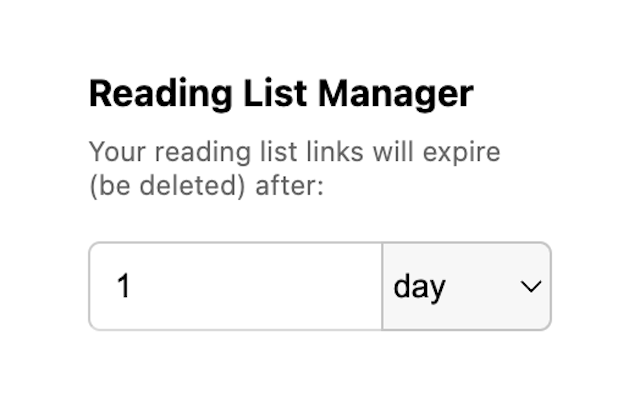

# Reading List Manager: Set Expiry for Links


Effortlessly set expiry dates for your Chrome Reading List links. Automatically remove expired links with ease.



## Prerequisites

* [node + npm](https://nodejs.org/) (Current Version)

## Setup

```
npm install
```


## Build

```
npm run build
```

## Watch

```
npm run watch
```

## Load extension to chrome

Load `dist` directory

## Test
`npx jest` or `npm run test`
